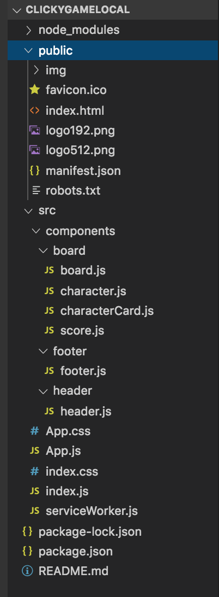

# Clicky-Game: NBA Edition

## `Summary`
'clicky-game: NBA Edition' is an application, built upon React, would test upon the user's memory based on clicking a different card of an NBA player. There are 16 total NBA Player cards drawn on the board for this game. After the user click on any of the 16 cards of NBA players, it will be reshuffled automatically and the user must select a different card from what they previously chose. If the user selects a different card from the selected, the scoreboard will update and give them 1 point. The maximum amount of points the user can get is 16. If the user selects a NBA Player card that they had already selected, the game will reset the score back to 0.

### `Demo link`
https://salty-taiga-01960.herokuapp.com/

### `File Structure`


## `Getting Started`
The simpliest way in seeing a demo of 'clicky-game: NBA Edition' is to click on the Heroku demo link right above that leads it directly to the project without any installations required. This link can be found within this readme file or at the description area within https://github.com/duongsters/clicky-game

To connect locally...
1) Clone 'clicky-game: NBA Edition' repository via https://github.com/duongsters/clicky-game
2) Run command line Terminal (or via Gitbash) 'npm install' for required NPMs used within the application ('npm i express express-handlebars axios cheerio mongoose morgan')...or just download all NPMs from Technologies Used below.
3) Run command line 'node server.js' to start up the application
4) Once connected to http://localhost:8080/ from CLI, copy that exact link to URL
5) Run 'ctrl + c' within the CLI to exit 'news-to-scrape' entirely


## `Technologies Used`
- HTML
- CSS
- Javascript
- React

## `Learning Experience`
- Learned to write **React**
- Learned to write **ECMA 6** (aka ES6)
- Learned to shuffle **Arrays** by **Desctructuring**
- Learned to update **Arrays** using **setState**
- Learned to use **Components** and **Props**
- Learned **inline-styling**

## `Code Snippets`
via :
* This code snippet shows ..
```javascript

```
via :
* The ...
```javascript

```


## Author Links:
- [GitHub](https://github.com/duongsters) ||
 [LinkIn](https://www.linkedin.com/in/theandrewduong/) ||
 [Portfolio](https://www.duongsters.github.io/updated-portfolio/)
